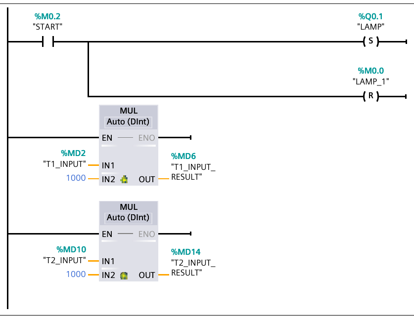
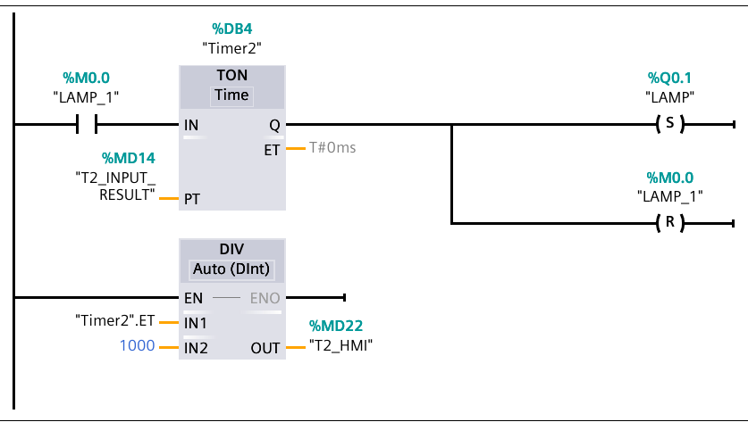
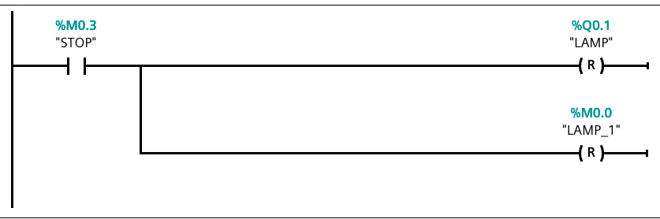
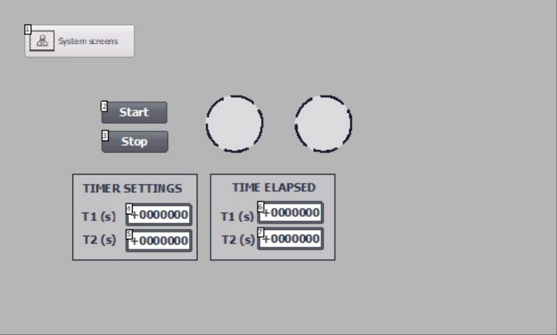
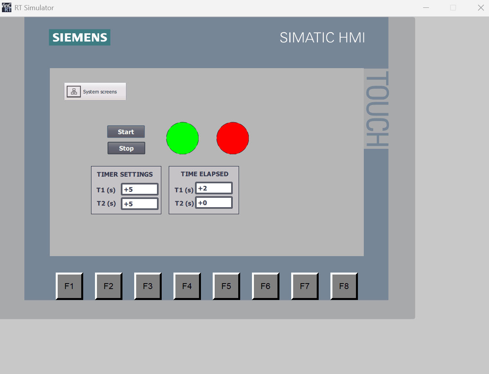
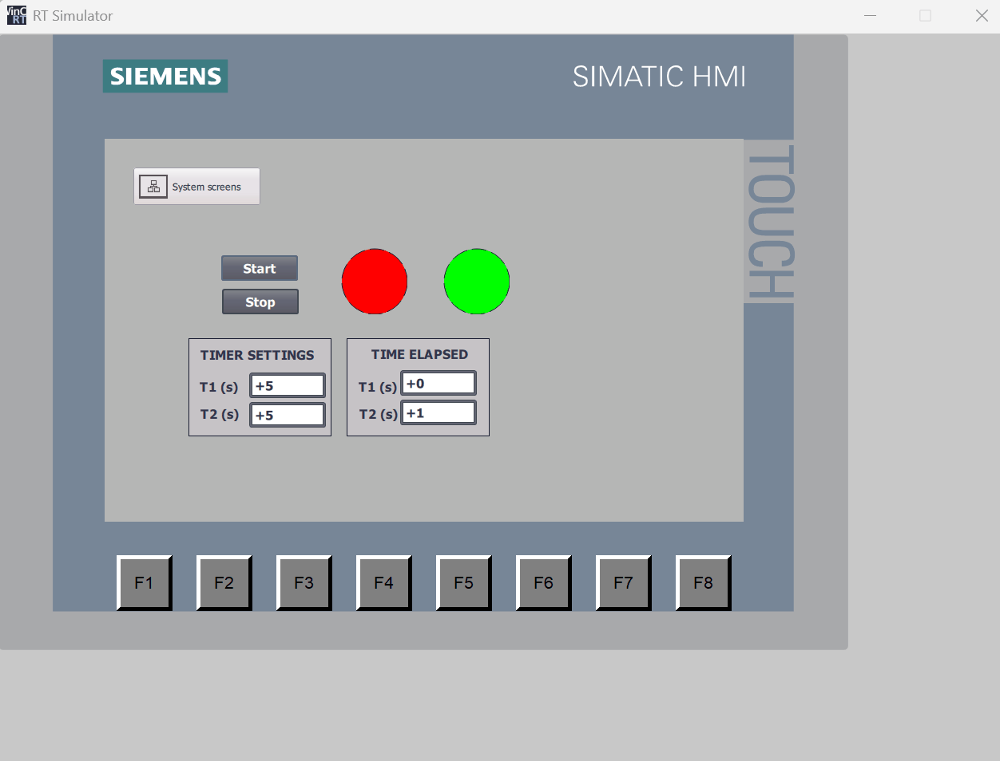

# Lab 1 — Alternating lamp with adjustable ON/OFF times

A single lamp blinks with independently adjustable ON and OFF durations. The
operator types both times in seconds on the KTP700 panel; the program converts
them to milliseconds, drives two `TON` timers in a ping-pong arrangement, and
feeds the elapsed time of each phase back to the panel in seconds. START and
STOP are latching.

TIA project: `LAb1.1` · CPU 1211C AC/DC/Rly · one block, `Main [OB1]`, LAD,
4 networks.

## Objective

From the course lab guide, *S7-1200 Extended Exercise 1.1 — Alternating ON
state, custom timer input + delay*:

- The program displays a LAMP that alternates between ON and OFF for a
  specified period of time (in seconds).
- The user can specify Timer 1 for ON and Timer 2 for OFF.
- Counter for time elapsed for each output.
- START/STOP button to begin/halt the whole program.

The guide also notes that `MUL` is needed because TIA Portal timers take
milliseconds, and `DIV` is needed to display the elapsed time in seconds.

## Hardware and I/O

`Default tag table [39]` as printed. This project defines no tag comments; the
Description column below is derived from the logic.

| Address | Symbol | Data type | Description |
|---|---|---|---|
| %Q0.1 | `LAMP` | Bool | The lamp. The only physical output. |
| %M0.0 | `LAMP_1` | Bool | OFF-phase state bit — high while the lamp is off and Timer2 is running. Not a lamp (see Notes). |
| %M0.2 | `START` | Bool | Start command from the HMI. |
| %M0.3 | `STOP` | Bool | Stop command from the HMI. |
| %MD2 | `T1_INPUT` | DInt | ON time setpoint, seconds, entered on the HMI. |
| %MD6 | `T1_INPUT_RESULT` | DInt | ON time in milliseconds — `T1_INPUT × 1000`. Timer1 preset. |
| %MD10 | `T2_INPUT` | DInt | OFF time setpoint, seconds, entered on the HMI. |
| %MD14 | `T2_INPUT_RESULT` | DInt | OFF time in milliseconds — `T2_INPUT × 1000`. Timer2 preset. |
| %MD18 | `T1_HMI` | DInt | Elapsed ON time, seconds — `Timer1.ET ÷ 1000`. |
| %MD22 | `T2_HMI` | DInt | Elapsed OFF time, seconds — `Timer2.ET ÷ 1000`. |

There are no `%I` inputs: START and STOP are memory bits driven from the panel.

## Control requirements

1. Pressing START turns the lamp on and starts the ON timer.
2. After `T1` seconds the lamp turns off and the OFF timer starts.
3. After `T2` seconds the lamp turns on again and the cycle repeats
   indefinitely.
4. `T1` and `T2` are entered in seconds on the HMI and take effect on the next
   phase.
5. The elapsed time of the running phase is displayed in seconds.
6. Pressing STOP turns the lamp off and halts the cycle.

## Program structure

| Block | Type | Language | Purpose |
|---|---|---|---|
| `Main` | OB1 | LAD | The whole program — 4 networks |
| `Timer1` | DB3 | DB | `IEC_TIMER` instance for the ON phase |
| `Timer2` | DB4 | DB | `IEC_TIMER` instance for the OFF phase |

## Implementation

### Network 1 — Start latch and seconds-to-milliseconds conversion

A normally open `START` contact drives two coils: `S LAMP` sets the lamp, and
`R LAMP_1` clears the OFF-phase bit. Because they are set/reset coils rather
than ordinary coils, the lamp stays on after the operator releases START —
this is the set/reset latch pattern, and it is what makes the button a
momentary push rather than a maintained switch.

The two `MUL Auto (DInt)` boxes hang directly off the left power rail, so they
execute every scan regardless of START. Each multiplies an operator setpoint
by 1000: `T1_INPUT × 1000 → T1_INPUT_RESULT` and
`T2_INPUT × 1000 → T2_INPUT_RESULT`. IEC timers take a `Time` preset in
milliseconds, so this is the unit conversion from the operator's seconds to
the timer's milliseconds. Running it unconditionally means a new setpoint is
picked up as soon as it is typed.

### Network 2 — ON phase: lamp on, Timer1 running

`LAMP` (NO) feeds the `IN` input of `TON Timer1`, whose `PT` comes from
`T1_INPUT_RESULT`. While the lamp is on, the timer runs. When it expires, `Q`
goes true and drives two coils: `R LAMP` turns the lamp off and `S LAMP_1`
arms the OFF phase.

The timer is self-cancelling: the moment `R LAMP` executes, `IN` drops, the
`TON` resets, `Q` falls, and `ET` returns to zero. That is the standard way to
build a one-shot delay out of a `TON` without an extra latch.

A `DIV Auto (DInt)` off the rail divides `Timer1.ET` by 1000 into `T1_HMI`, so
the panel shows the elapsed ON time in whole seconds.

### Network 3 — OFF phase: lamp off, Timer2 running

The mirror image of Network 2. `LAMP_1` (NO) runs `TON Timer2` with
`PT = T2_INPUT_RESULT`; on expiry `S LAMP` turns the lamp back on and
`R LAMP_1` clears the OFF-phase bit, which stops and resets Timer2.

Networks 2 and 3 together form a two-timer oscillator: each network's coil
condition is the other network's timer enable, so the pair free-runs with
period `T1 + T2` and duty cycle `T1 / (T1 + T2)`. The reason two timers are
needed rather than one is precisely that the ON and OFF durations are
independent.

`DIV Timer2.ET ÷ 1000 → T2_HMI` displays the elapsed OFF time in seconds.

### Network 4 — Stop

`STOP` (NO) resets both `LAMP` and `LAMP_1`. With both bits low, neither timer
has an enable condition, so the oscillator stops with the lamp dark. Restarting
requires START, which re-enters the cycle at the ON phase.

## HMI

`HMI_1 [KTP700 Basic PN]`, screen `Root screen`, connection
`HMI_Connection_1`.

| HMI tag | Data type | Bound to | Screen element |
|---|---|---|---|
| `START` | Bool | `START` %M0.2 | Start button (`SetBit`) |
| `STOP` | Bool | `STOP` %M0.3 | Stop button (`SetBit`) |
| `LAMP` | Bool | `LAMP` %Q0.1 | Circle indicator |
| `LAMP_1` | Bool | `LAMP_1` %M0.0 | Circle indicator |
| `T1_INPUT` | DInt | `T1_INPUT` %MD2 | I/O field, *TIMER SETTINGS · T1 (s)* |
| `T2_INPUT` | DInt | `T2_INPUT` %MD10 | I/O field, *TIMER SETTINGS · T2 (s)* |
| `T1_HMI` | DInt | `T1_HMI` %MD18 | I/O field, *TIME ELAPSED · T1 (s)* |
| `T2_HMI` | DInt | `T2_HMI` %MD22 | I/O field, *TIME ELAPSED · T2 (s)* |
| `T2_INPUT_RESULT` | DInt | `T2_INPUT_RESULT` %MD14 | not placed on the screen |

### Runtime

Both phases of the cycle, captured in the WinCC RT Simulator against a
PLCSIM CPU with `T1 = 5 s` and `T2 = 5 s`.

*ON phase: the left indicator (`LAMP`) is green, the right one (`LAMP_1`) red,
and `TIME ELAPSED · T1` reads 2 of the 5 s setpoint.*

*OFF phase: the indicators have swapped and `TIME ELAPSED · T2` is counting
instead. Both circles animate on the same tag, green for 1 and red for 0.*

## Testing

Run on S7-PLCSIM with the WinCC RT Simulator, `T1 = T2 = 5 s`. *Actual*
records what the captures and the demo video show; rows marked **not run**
were not exercised in that session.

| # | Test case | Input | Expected | Actual | Result |
|---|---|---|---|---|---|
| 1 | Setpoints reach the timers | `T1_INPUT = 5`, `T2_INPUT = 5` | `T1_INPUT_RESULT = 5000`, `T2_INPUT_RESULT = 5000` | not observed — the `*_RESULT` tags are not on the panel; the correct phase lengths imply it | not run |
| 2 | Start latches | `START` pressed, then released | `LAMP = 1` and stays 1 | lamp stays lit after the button is released (demo) | **Pass** |
| 3 | ON phase ends, OFF phase begins | after test 2 | `LAMP` drops, `LAMP_1 = 1` | handover observed on every cycle of the demo | **Pass** |
| 4 | OFF phase ends, ON phase begins | after test 3 | `LAMP` rises again | the cycle repeats without further input | **Pass** |
| 5 | Elapsed display | mid ON phase | `T1_HMI` counts up in seconds | `TIME ELAPSED · T1` = 2 while `T2` holds 0 (capture) | **Pass** |
| 6 | Setpoint change on the fly | `T1_INPUT = 2` while running | next ON phase lasts 2 s | not exercised | not run |
| 7 | Stop | `STOP` pressed | `LAMP = 0`, `LAMP_1 = 0`, both timers idle | both indicators go red and stay red (end of demo) | **Pass** |
| 8 | Zero setpoint | `T1_INPUT = 0` | lamp toggles every scan — document the behaviour | not exercised | not run |

## Demo

[`videos/lab-01-demo.mp4`](../../videos/lab-01-demo.mp4) — 16 s, screen
recording of the RT Simulator: start, one full ON/OFF cycle, stop.

## Notes

Carried over from [`docs/extraction-notes.md#findings`](../../docs/extraction-notes.md#findings):

- **F-1.1** The watch table comments for `T1_HMI`/`T2_HMI` and
  `T1_INPUT`/`T2_INPUT` are swapped — the setpoints are commented as displays
  and vice versa.
- **F-1.2** `LAMP_1` %M0.0 is the OFF-phase state bit, not a second lamp, but
  it is named and exported to the HMI as if it were one.
- **F-1.3** The HMI tag table exports `T2_INPUT_RESULT` but not
  `T1_INPUT_RESULT`; neither belongs on the panel.
- **F-1.4** The guide asks for a "counter for time elapsed"; this project uses
  `DIV` on `Timer.ET` instead of a counter instruction.
- **F-0.1** `START`/`STOP` are memory bits, so the kit's physical switch panel
  cannot drive this program without rewiring them to `%I0.x`.
- **F-0.3** The project contains a duplicate second panel, `HMI_2`, which this
  document does not cover.

---

← previous · [Lab 2 — Sequential three-lamp cycle →](../02-sequential-traffic-lights/README.md)
