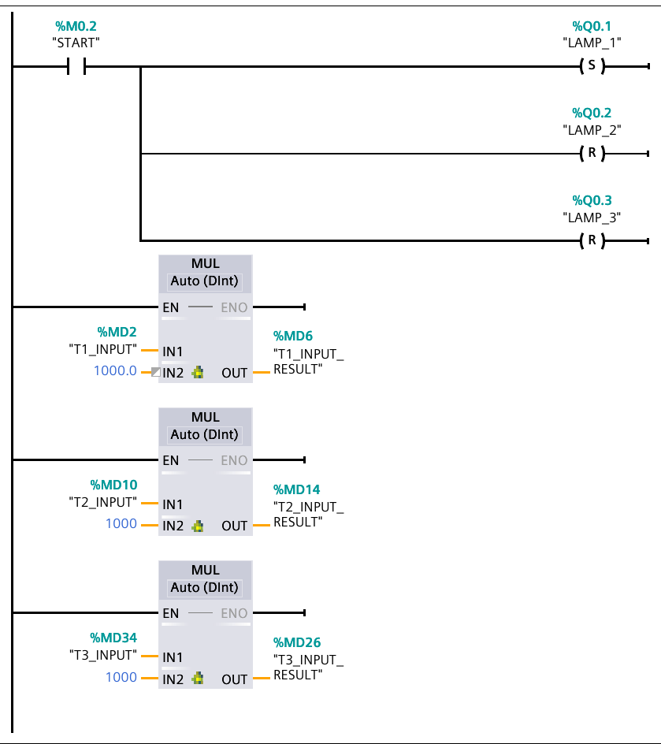
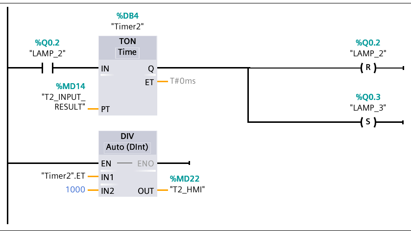
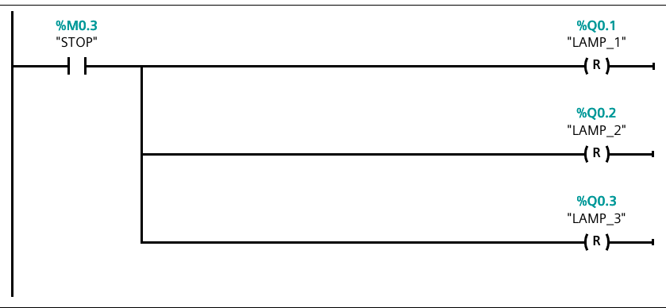
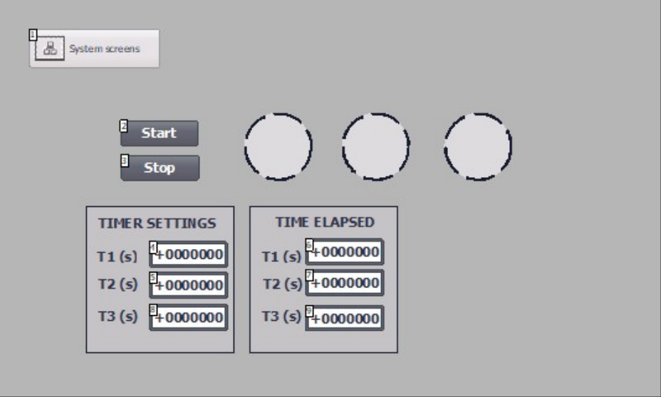
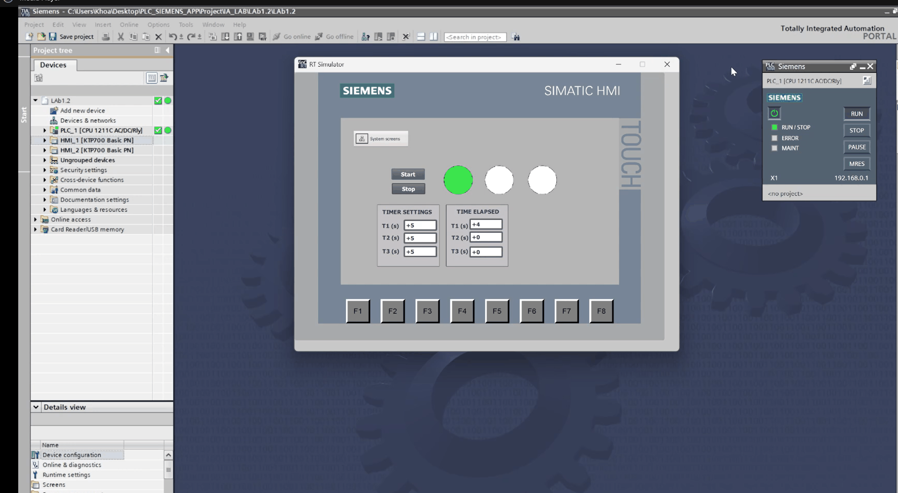
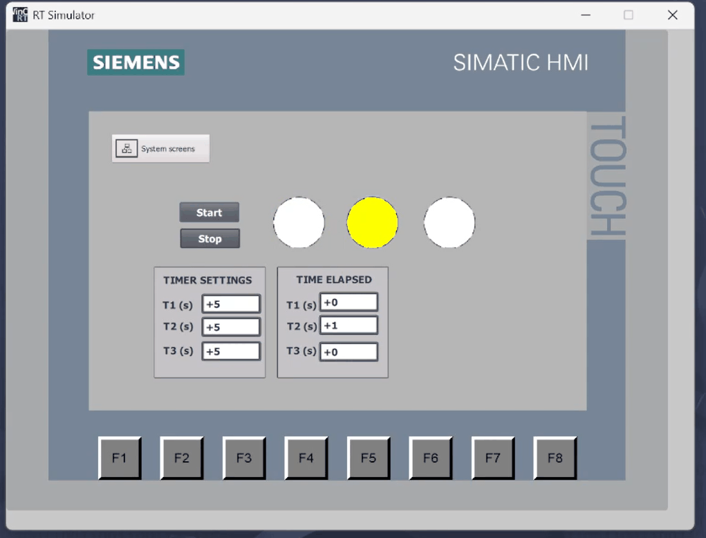
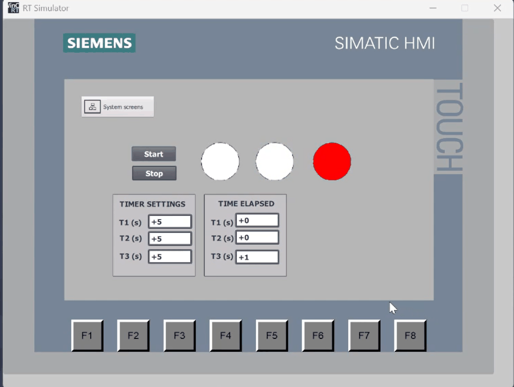

# Lab 2 — Sequential three-lamp cycle

Three lamps light one at a time in a repeating ring: green for T1, then yellow
for T2, then red for T3, then back to green. Each duration is entered in
seconds on the KTP700 panel and each phase reports its elapsed time. STOP
clears all three lamps.

TIA project: `LAb1.2` · CPU 1211C AC/DC/Rly · one block, `Main [OB1]`, LAD,
5 networks.

## Objective

From the course lab guide, *S7-1200 Extended Exercise 1.2 — Previous EX +
Sequential Lights*:

- Press START to begin the sequence.
- Light 1 is ON for T1 (seconds), then OFF as Light 2 is ON for T2 (seconds),
  then OFF as Light 3 is ON for T3 (seconds).
- Display time elapsed of each light on the HMI panel.
- The program resets after pressing the STOP button.
- Optionally let the colour of L1, L2 and L3 be green, yellow and red when
  they are ON.

## Hardware and I/O

`Default tag table [43]` as printed, comments as they appear in the project.

| Address | Symbol | Data type | Description |
|---|---|---|---|
| %Q0.1 | `LAMP_1` | Bool | Đèn Xanh — green lamp |
| %Q0.2 | `LAMP_2` | Bool | Đèn Vàng — yellow lamp |
| %Q0.3 | `LAMP_3` | Bool | Đèn ĐỎ — red lamp |
| %M0.2 | `START` | Bool | Start command from the HMI |
| %M0.3 | `STOP` | Bool | Stop command from the HMI |
| %MD2 | `T1_INPUT` | DInt | Nhập T1 từ HMI — green duration setpoint, s |
| %MD6 | `T1_INPUT_RESULT` | DInt | T1x1000ms — Timer1 preset, ms |
| %MD10 | `T2_INPUT` | DInt | Nhập T2 từ HMI — yellow duration setpoint, s |
| %MD14 | `T2_INPUT_RESULT` | DInt | T2x1000ms — Timer2 preset, ms |
| %MD34 | `T3_INPUT` | DInt | Nhập T3 từ HMI — red duration setpoint, s |
| %MD26 | `T3_INPUT_RESULT` | DInt | T3x1000ms — Timer3 preset, ms |
| %MD18 | `T1_HMI` | DInt | Hiển thị T1 Elapsed — elapsed green time, s |
| %MD22 | `T2_HMI` | DInt | Hiển thị T2 Elapsed — elapsed yellow time, s |
| %MD30 | `T3_HMI` | DInt | Hiển thị T3 Elapsed — elapsed red time, s |

No `%I` inputs; START and STOP are memory bits driven from the panel.

## Control requirements

1. Pressing START lights lamp 1 and clears lamps 2 and 3.
2. After T1 seconds lamp 1 goes out and lamp 2 lights.
3. After T2 seconds lamp 2 goes out and lamp 3 lights.
4. After T3 seconds lamp 3 goes out and lamp 1 lights again — the ring
   repeats indefinitely.
5. T1, T2 and T3 are entered in seconds on the HMI.
6. The elapsed time of each phase is displayed in seconds.
7. Pressing STOP clears all three lamps and stops the sequence.

## Program structure

| Block | Type | Language | Purpose |
|---|---|---|---|
| `Main` | OB1 | LAD | The whole program — 5 networks |
| `Timer1` | DB3 | DB | `IEC_TIMER` instance, green phase |
| `Timer2` | DB4 | DB | `IEC_TIMER` instance, yellow phase |
| `Timer3` | DB1 | DB | `IEC_TIMER` instance, red phase |

## Implementation

### Network 1 — "Đèn Xanh": start latch and three unit conversions

`START` (NO) sets `LAMP_1` and resets `LAMP_2` and `LAMP_3`. Resetting the
other two on start matters: it guarantees the sequence always re-enters at the
green phase no matter which lamp was lit when the program last stopped.

Three `MUL Auto (DInt)` boxes off the left rail convert each setpoint from
seconds to the milliseconds the IEC timers expect:
`T1_INPUT × 1000 → T1_INPUT_RESULT`, and likewise for T2 and T3. They run
unconditionally, so a setpoint typed on the panel is live on the next scan.

### Network 2 — "Đèn vàng": green → yellow

`LAMP_1` (NO) enables `TON Timer1` with `PT = T1_INPUT_RESULT`. On expiry, `Q`
resets `LAMP_1` and sets `LAMP_2`. Dropping `LAMP_1` removes the timer's own
enable, which resets `Timer1` ready for the next lap.

`DIV Timer1.ET ÷ 1000 → T1_HMI` publishes the elapsed green time in seconds.

### Network 3 — "Đèn đỏ": yellow → red

Same shape one step along: `LAMP_2` runs `TON Timer2` with
`PT = T2_INPUT_RESULT`; `Q` resets `LAMP_2` and sets `LAMP_3`.
`DIV Timer2.ET ÷ 1000 → T2_HMI`.

### Network 4 — red → green, closing the ring

`LAMP_3` runs `TON Timer3` with `PT = T3_INPUT_RESULT`; `Q` resets `LAMP_3`
and sets `LAMP_1`. This is the rung that turns the chain into a ring: the last
phase's coil is the first phase's enable, so the cycle free-runs with period
`T1 + T2 + T3`.

The pattern generalises — each step is one rung with `S next`/`R current`, so
adding a fourth lamp costs one network and one instance DB.

`DIV Timer3.ET ÷ 1000 → T3_HMI`.

### Network 5 — Stop

`STOP` (NO) resets all three lamps. With every lamp bit low, none of the three
timers has an enable, so all of them reset to zero and the sequence halts
dark. START re-enters at green.

## HMI

`HMI_1 [KTP700 Basic PN]`, screen `Root screen`, connection
`HMI_Connection_1`.

| HMI tag | Data type | Bound to | Screen element |
|---|---|---|---|
| `START` | Bool | `START` %M0.2 | Start button |
| `STOP` | Bool | `STOP` %M0.3 | Stop button |
| `LAMP_1` | Bool | `LAMP_1` %Q0.1 | Circle indicator (green) |
| `LAMP_2` | Bool | `LAMP_2` %Q0.2 | Circle indicator (yellow) |
| `LAMP_3` | Bool | `LAMP_3` %Q0.3 | Circle indicator (red) |
| `T1_INPUT` | DInt | %MD2 | I/O field, *TIMER SETTINGS · T1 (s)* |
| `T2_INPUT` | DInt | %MD10 | I/O field, *TIMER SETTINGS · T2 (s)* |
| `T3_INPUT` | DInt | %MD34 | I/O field, *TIMER SETTINGS · T3 (s)* |
| `T1_HMI` | DInt | %MD18 | I/O field, *TIME ELAPSED · T1 (s)* |
| `T2_HMI` | DInt | %MD22 | I/O field, *TIME ELAPSED · T2 (s)* |
| `T3_HMI` | DInt | %MD30 | I/O field, *TIME ELAPSED · T3 (s)* |

### Runtime

All three phases, captured in the WinCC RT Simulator against a PLCSIM CPU with
`T1 = T2 = T3 = 5 s`.

*Green phase, with the TIA project tree and the PLCSIM panel in frame: the CPU
is in RUN with no ERROR, and `TIME ELAPSED · T1` reads 4 of 5 s.*

*Yellow phase. `LAMP_1` has dropped, `LAMP_2` is lit, and the elapsed counter
has moved from T1 to T2.*

*Red phase — the last step before the ring closes back to green.*

## Testing

Run on S7-PLCSIM with the WinCC RT Simulator, `T1 = T2 = T3 = 5 s` — not the
values in the project's stale watch table. *Actual* records what the captures
and the demo video show; rows marked **not run** were not exercised in that
session.

| # | Test case | Input | Expected | Actual | Result |
|---|---|---|---|---|---|
| 1 | Setpoints reach the timers | `T1 = T2 = T3 = 5` | `T1_INPUT_RESULT = T2_INPUT_RESULT = T3_INPUT_RESULT = 5000` | not observed — the `*_RESULT` tags are not on the panel; equal phase lengths imply it | not run |
| 2 | Start | `START` pressed, then released | `LAMP_1 = 1`, `LAMP_2 = 0`, `LAMP_3 = 0` | green lights alone and stays lit after release (capture, demo) | **Pass** |
| 3 | Green → yellow | after 5 s | `LAMP_1 = 0`, `LAMP_2 = 1` | handover observed (capture, demo) | **Pass** |
| 4 | Yellow → red | after a further 5 s | `LAMP_2 = 0`, `LAMP_3 = 1` | handover observed (capture, demo) | **Pass** |
| 5 | Red → green (ring closes) | after a further 5 s | `LAMP_3 = 0`, `LAMP_1 = 1` | the demo runs past red back to green with no further input | **Pass** |
| 6 | Only one lamp at a time | throughout a full cycle | exactly one of %Q0.1–%Q0.3 is high at any moment | all three captures and every frame of the demo show exactly one lit circle | **Pass** |
| 7 | Elapsed displays | mid cycle | the running phase's `Tn_HMI` counts up, the others hold 0 | green capture: T1 = 4, T2 = 0, T3 = 0; the counter follows the active phase | **Pass** |
| 8 | Stop mid-cycle | `STOP` during yellow | all three lamps 0, all timers reset | not exercised | not run |
| 9 | Restart after stop | `START` again | sequence restarts at green, not at yellow | not exercised | not run |
| 10 | Real literal in `MUL` (F-2.1) | compile and download | project compiles and runs | compiled, downloaded and ran on PLCSIM — RUN lit, ERROR dark (capture) | **Pass** |

## Demo

[`videos/lab-02-demo.mp4`](../../videos/lab-02-demo.mp4) — 25 s, screen
recording of the RT Simulator: start, then green → yellow → red → green.

## Notes

Carried over from [`docs/extraction-notes.md#findings`](../../docs/extraction-notes.md#findings):

- **F-2.1** In Network 1 the first `MUL Auto (DInt)` has `IN2 = 1000.0`, a
  Real literal, while the other two use `1000`. Confirm it compiles clean and
  make all three consistent.
- **F-2.2** `Watch table_1` is a copy of Lab 1's. It still watches
  `"LAMP" %Q0.1` — a tag name that does not exist here — and has no T3 rows.
- **F-2.3** T3 breaks the address pattern: `T3_INPUT` = %MD34 but
  `T3_INPUT_RESULT` = %MD26, whereas T1 and T2 run input→result ascending.
- **F-2.4** The guide asks for green/yellow/red lamps. The tag comments agree,
  but colour animation does not appear in the printed hardcopy, so the colours
  have to be confirmed on the running panel.
- **F-0.1** No `%I` inputs — the kit's switch panel cannot drive this program
  as configured.
- **F-0.3** The project contains a duplicate second panel, `HMI_2`, not
  covered here.

---

[← Lab 1 — Alternating lamp](../01-alternating-lamp-timers/README.md) · [Lab 3 — Cycle counter with automatic stop →](../03-counter-auto-stop/README.md)
