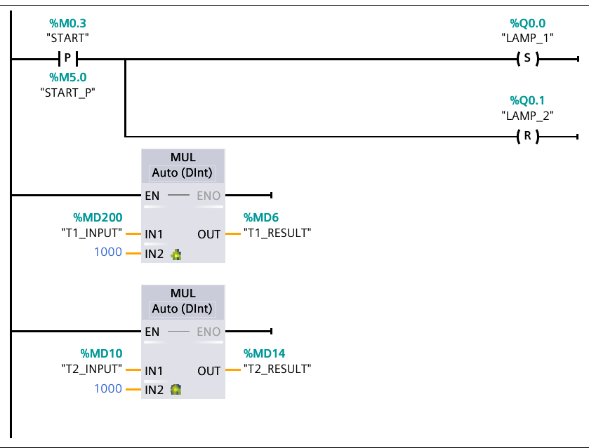
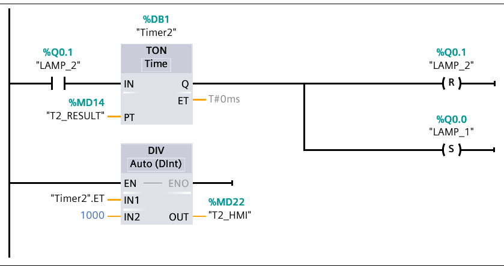
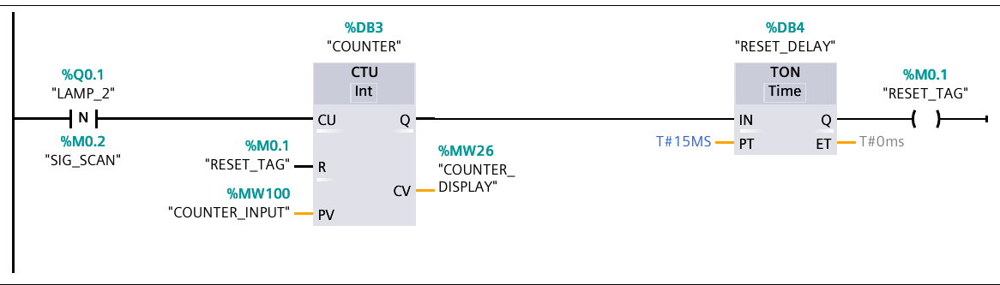
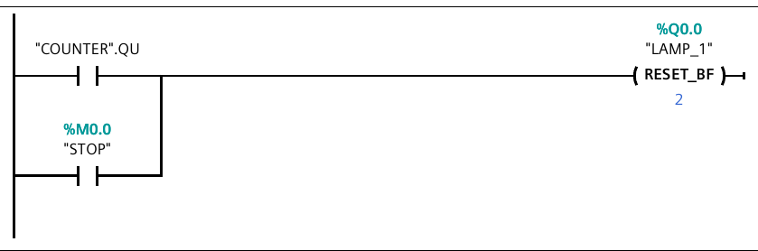
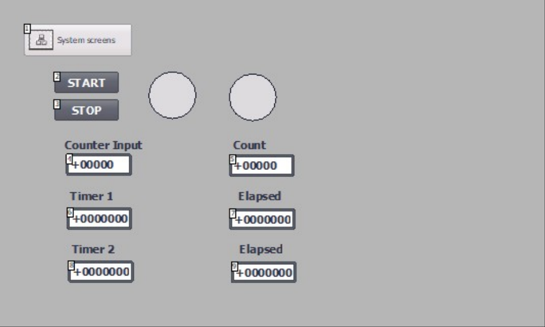

# Lab 3 — Cycle counter with automatic stop

Two lamps alternate exactly as in Lab 1, but every completed cycle is counted.
A falling edge on lamp 2 increments a `CTU`; when the count reaches the limit
the operator entered on the panel, the counter's `Q` output resets both lamps
through a `RESET_BF` bit-field reset and clears itself. The program therefore
stops on its own after N cycles, or earlier if STOP is pressed.

TIA project: `Lab1.3` · CPU 1211C AC/DC/Rly · one block, `Main [OB1]`, LAD,
5 networks.

## Objective

From the course lab guide, *S7-1200 Extended Exercise 1.3 — Counter Up (CTU),
Negative Signal edge, Bit Field (BF) reset*:

- Press START to begin the sequence.
- Light 1 is ON for T1 (seconds), then OFF as Light 2 is ON for T2 (seconds).
- As Light 2 turns OFF, its negative signal (from 1 to 0) is counted, up to N
  times.
- The program automatically STOPs after reaching N times.
- The program is reset when one of two conditions is met: the CTU reaches its
  count-up limit, or the STOP button is activated.
- Starting with the first output bit `L1`, the number of bits to be reset
  is 2.

## Hardware and I/O

`Default tag table [44]` as printed, comments as they appear in the project.

| Address | Symbol | Data type | Description |
|---|---|---|---|
| %Q0.0 | `LAMP_1` | Bool | Đèn 1 xanh — lamp 1 (green) |
| %Q0.1 | `LAMP_2` | Bool | Đèn 2 vàng — lamp 2 (yellow) |
| %M0.0 | `STOP` | Bool | Nút STOP |
| %M0.1 | `RESET_TAG` | Bool | Tự reset CTU — auto-reset pulse for the counter |
| %M0.2 | `SIG_SCAN` | Bool | Bộ nhớ scan L2 — edge-memory bit for the `N` scan |
| %M0.3 | `START` | Bool | Nút START |
| %M5.0 | `START_P` | Bool | Edge-memory bit for the `P` scan on START |
| %MW26 | `COUNTER_DISPLAY` | Int | Giá trị đếm CV — current count |
| %MW100 | `COUNTER_INPUT` | Int | Giới hạn N — count limit, entered on the HMI |
| %MD200 | `T1_INPUT` | DInt | Thời gian T1 nhập — lamp 1 duration setpoint, s |
| %MD6 | `T1_RESULT` | DInt | T1 × 1000 ms — Timer1 preset |
| %MD10 | `T2_INPUT` | DInt | Thời gian T2 nhập — lamp 2 duration setpoint, s |
| %MD14 | `T2_RESULT` | DInt | T2 × 1000 ms — Timer2 preset |
| %MD18 | `T1_HMI` | DInt | Hiển thị T1 elapsed |
| %MD22 | `T2_HMI` | DInt | Hiển thị T2 elapsed |

## Control requirements

1. Pressing START (on the rising edge only) lights lamp 1 and clears lamp 2.
2. After T1 seconds lamp 1 goes out and lamp 2 lights.
3. After T2 seconds lamp 2 goes out and lamp 1 lights again.
4. Each time lamp 2 goes out — a 1→0 transition — the counter increments.
5. The count and the limit N are both shown on the HMI.
6. When the count reaches N, both lamps are reset and the counter clears
   itself, so the program stops.
7. Pressing STOP resets both lamps at any time.

## Program structure

| Block | Type | Language | Purpose |
|---|---|---|---|
| `Main` | OB1 | LAD | The whole program — 5 networks |
| `Timer1` | DB2 | DB | `IEC_TIMER`, lamp 1 phase |
| `Timer2` | DB1 | DB | `IEC_TIMER`, lamp 2 phase |
| `COUNTER` | DB3 | DB | `IEC_COUNTER` (Int), cycle counter |
| `RESET_DELAY` | DB4 | DB | `IEC_TIMER`, one-shot that pulses `RESET_TAG` |

## Implementation

### Network 1 — "Đèn 1 xanh": edge-triggered start and unit conversion

`START` %M0.3 is scanned with a **positive edge** contact (`P`) whose edge
memory is `START_P` %M5.0. Using an edge instead of a level matters here: the
rung sets `LAMP_1` and resets `LAMP_2` only on the scan where START goes from
0 to 1, so holding the button down cannot keep forcing the sequence back to
step 1 while it is running.

Two `MUL Auto (DInt)` boxes off the rail convert the setpoints to
milliseconds: `T1_INPUT × 1000 → T1_RESULT`, `T2_INPUT × 1000 → T2_RESULT`.

### Network 2 — Timer1: lamp 1 → lamp 2

`LAMP_1` (NO) enables `TON Timer1` with `PT = T1_RESULT`. On expiry `Q` resets
`LAMP_1` and sets `LAMP_2`. `DIV Timer1.ET ÷ 1000 → T1_HMI`.

### Network 3 — Timer2: lamp 2 → lamp 1, closing the loop

`LAMP_2` (NO) enables `TON Timer2` with `PT = T2_RESULT`. On expiry `Q` resets
`LAMP_2` and sets `LAMP_1`, which restarts the two-timer oscillator. Every lap
of this loop is one "cycle" as far as the counter is concerned.

### Network 4 — "CTU đếm sườn âm L2 + Auto Stop"

The counting and the auto-stop live in one rung.

`LAMP_2` %Q0.1 is scanned with a **negative edge** contact (`N`), edge memory
`SIG_SCAN` %M0.2. That contact conducts for exactly one scan each time lamp 2
turns off, which is once per completed cycle — this is why the falling edge is
used rather than the level: a level would count once per scan for the whole
lamp-2 phase.

The pulse drives `CU` of `CTU Int` in instance `COUNTER` [DB3]:

- `PV` = `COUNTER_INPUT` %MW100 — the limit N typed on the panel.
- `CV` = `COUNTER_DISPLAY` %MW26 — the live count, shown on the panel.
- `R` = `RESET_TAG` %M0.1.

`Q` of the counter goes true as soon as `CV ≥ PV`, and it feeds
`TON RESET_DELAY` [DB4] with `PT = T#15 ms`, whose `Q` drives the ordinary
coil `RESET_TAG` %M0.1. `RESET_TAG` is wired back to the counter's own `R`
input, so the counter clears itself a few milliseconds after reaching the
limit. The short delay exists to let Network 5 see `"COUNTER".QU` before the
counter is wiped.

### Network 5 — STOP: bit-field reset

Two normally open contacts in parallel — `"COUNTER".QU` and `STOP` %M0.0 —
drive a `RESET_BF` coil on `LAMP_1` %Q0.0 with a width of **2**.

`RESET_BF` clears a run of consecutive bits starting at the given address, so
this one clears %Q0.0 and %Q0.1 — both lamps — in a single instruction instead
of two reset coils. Because the two conditions are in parallel, the program
stops for either reason: the counter hit its limit, or the operator pressed
STOP. With both lamps low neither timer has an enable, so the oscillator
halts.

## HMI

`HMI_1 [KTP700 Basic PN]`, screen `Root screen`, connection
`HMI_Connection_1`.

| HMI tag | Data type | Bound to | Screen element |
|---|---|---|---|
| `START` | Bool | `START` %M0.3 | START button |
| `STOP` | Bool | `STOP` %M0.0 | STOP button |
| `LAMP_1` | Bool | `LAMP_1` %Q0.0 | Circle indicator |
| `LAMP_2` | Bool | `LAMP_2` %Q0.1 | Circle indicator |
| `COUNTER_INPUT` | Int | %MW100 | I/O field, *Counter Input* |
| `COUNTER_DISPLAY` | Int | %MW26 | I/O field, *Count* |
| `T1_INPUT` | DInt | %MD200 | I/O field, *Timer 1* |
| `T1_HMI` | DInt | %MD18 | I/O field, *Elapsed* |
| `T2_INPUT` | DInt | %MD10 | I/O field, *Timer 2* |
| `T2_HMI` | DInt | %MD22 | I/O field, *Elapsed* |

## Testing

This project has **no watch table** (see Notes), so nothing could be seeded
from it. The inputs below come from the lab guide's own example values.

| # | Test case | Input | Expected | Actual | Result |
|---|---|---|---|---|---|
| 1 | Setpoints reach the timers | `T1_INPUT = 5`, `T2_INPUT = 3` | `T1_RESULT = 5000`, `T2_RESULT = 3000` | > ⚠️ TODO | > ⚠️ TODO |
| 2 | Edge-triggered start | hold `START = TRUE` | lamps advance normally; holding START does not pin lamp 1 on | > ⚠️ TODO | > ⚠️ TODO |
| 3 | Oscillation | after start | %Q0.0 and %Q0.1 alternate with 5 s / 3 s | > ⚠️ TODO | > ⚠️ TODO |
| 4 | Count increments once per cycle | `COUNTER_INPUT = 5`, run 3 cycles | `COUNTER_DISPLAY = 3` | > ⚠️ TODO | > ⚠️ TODO |
| 5 | Count does not increment during the lamp-2 phase | mid lamp-2 phase | `COUNTER_DISPLAY` unchanged until lamp 2 goes out | > ⚠️ TODO | > ⚠️ TODO |
| 6 | Automatic stop at N | `COUNTER_INPUT = 5`, let it run | both lamps clear on the 5th falling edge | > ⚠️ TODO | > ⚠️ TODO |
| 7 | Counter self-reset | after test 6 | `COUNTER_DISPLAY` returns to 0 | > ⚠️ TODO | > ⚠️ TODO |
| 8 | Manual stop | `STOP = TRUE` mid-cycle | both lamps clear immediately | > ⚠️ TODO | > ⚠️ TODO |
| 9 | Count after manual stop (F-3.3) | `STOP` at count 2 | document what `COUNTER_DISPLAY` shows — the guide's "Extra" wants 0 | > ⚠️ TODO | > ⚠️ TODO |
| 10 | Restart after auto-stop | `START = TRUE` | sequence restarts from lamp 1, count from 0 | > ⚠️ TODO | > ⚠️ TODO |

## Demo

> ⚠️ TODO — record the demo, upload it unlisted, and replace the URL.

## Notes

Carried over from [`docs/extraction-notes.md#findings`](../../docs/extraction-notes.md#findings):

- **F-3.1** The project has no watch table — only an empty force table. Test
  inputs above are from the lab guide, not from the project.
- **F-3.2** The guide says the CTU is "currently DInt"; the project uses
  `CTU Int` with Int `PV`/`CV`. The project is self-consistent; the guide text
  is stale.
- **F-3.3** STOP does not clear the counter. `RESET_BF` only touches the lamp
  outputs; `COUNTER` is reset by `RESET_TAG`, which is pulsed only when `QU`
  goes true. The guide's "Extra" task asks for the counter to be reset by STOP
  as well — that is still open.
- **F-3.4** `T1_INPUT` sits at %MD200, far outside the %MD2–%MD26 block used by
  everything else. Probably a typo for %MD2.
- **F-3.5** `RESET_DELAY` uses `PT = T#15 ms`, close to a single scan. It works
  but it is timing-fragile; a `P` edge on `"COUNTER".QU` would express the
  intent more robustly.
- **F-0.1** No `%I` inputs.
- **F-0.3** The project contains a duplicate second panel, `HMI_2`, not covered
  here.

---

[← Lab 2 — Sequential three-lamp cycle](../02-sequential-traffic-lights/README.md) · [Lab 4 — Water tank, automatic and manual →](../04-water-tank-auto-manual/README.md)
