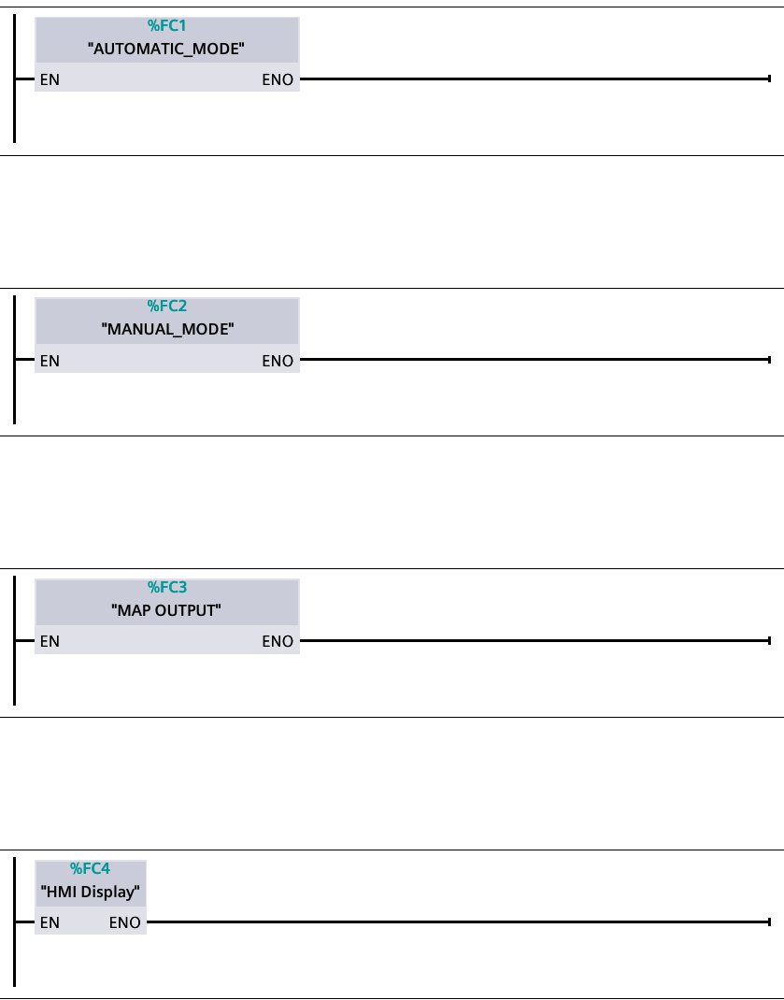
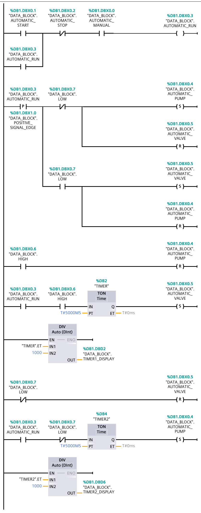
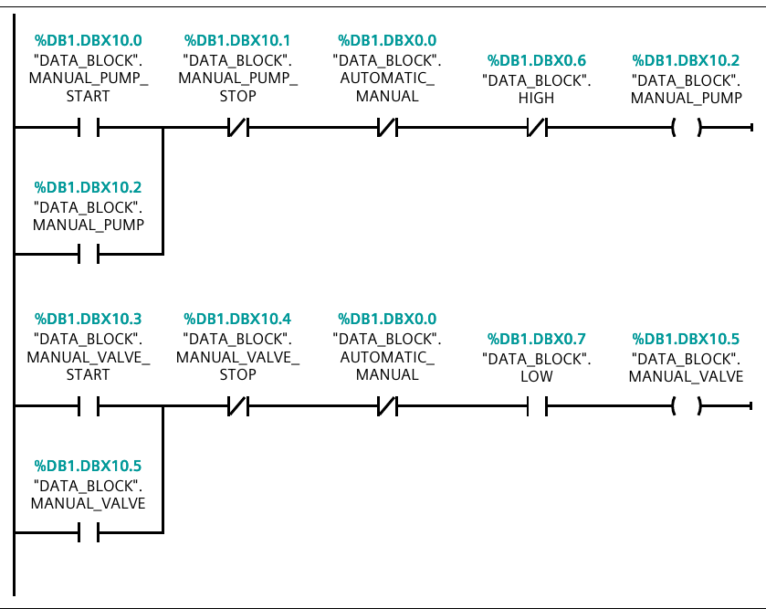
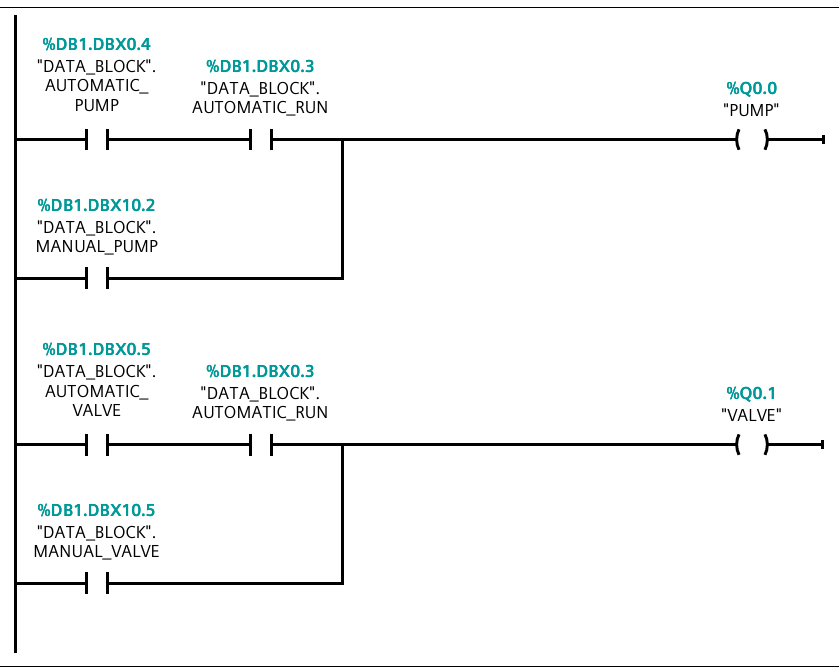
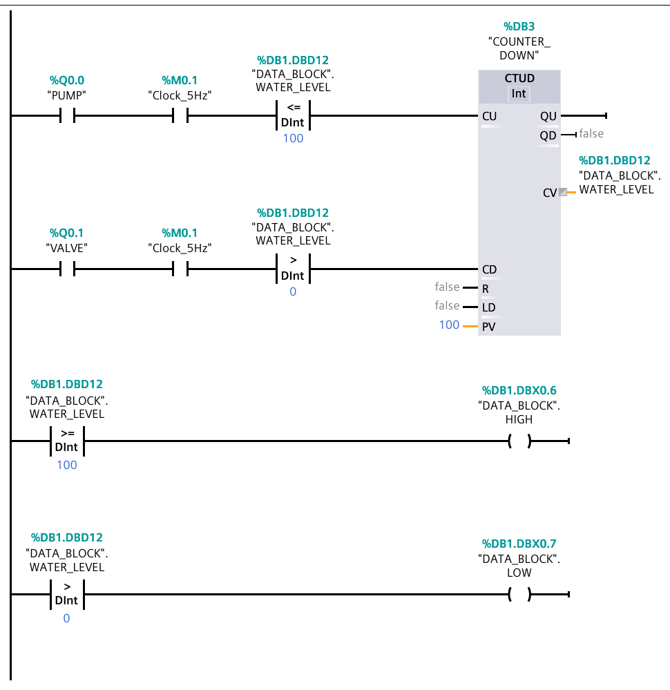
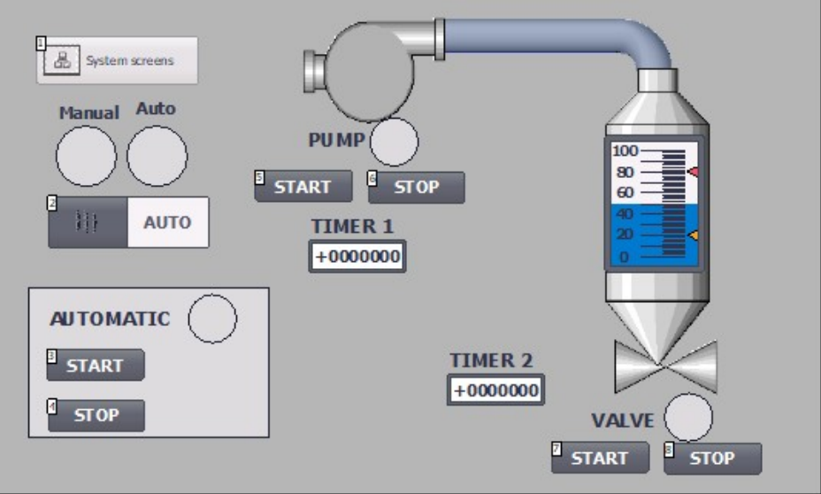

# Lab 4 — Water tank, automatic and manual control

A water tank filled by a pump and drained by a valve, with two operating
modes. In automatic mode the controller cycles fill → dwell 5 s → drain →
dwell 5 s indefinitely; in manual mode the operator drives the pump and the
valve directly, with the level limits still acting as interlocks. The tank
level itself is simulated inside the PLC by a `CTUD` clocked from the CPU's
clock memory, so the lab runs without any field instrumentation.

This is the first lab in the series with real program structure: `OB1` calls
four `FC` blocks, and all state lives in one non-optimized data block.

TIA project: `Lab1.4` · CPU 1211C AC/DC/Rly · `Main [OB1]` + FC1–FC4 + DB1,
LAD.

## Objective

From the course lab guide, *S7-1200 Extended Exercise 1.4 — Auto-Manual
control, water pump, release valve, water tank*:

- The program features a water tank with its water level monitored by two
  switch-sensors, at 0 % and 100 %.
- A pump increases the water level, a valve decreases it.
- Two control modes: Automatic and Manual.
- In Automatic mode: after START, the pump increases the water level until it
  reaches 100 %. The pump stops and a counter counts 5 s before starting the
  valve. The valve releases water until the level reaches 0 %. Another timer
  runs for 5 s before the pump starts again, until the STOP button is pressed.
- In Manual mode, both the pump and the valve can be turned on or off
  manually.
- The exercise requires the use of clock memory, and the program is divided
  into smaller `FC` and `DB` blocks. "Optimized block access" must be disabled
  on the data block so its members get absolute addresses.

## Hardware and I/O

### PLC tags — `Default tag table [45]`

Only two application tags; everything else in the table is the CPU's default
clock- and system-memory byte.

| Address | Symbol | Data type | Description |
|---|---|---|---|
| %Q0.0 | `PUMP` | Bool | Pump contactor |
| %Q0.1 | `VALVE` | Bool | Drain valve |
| %MB0 | `Clock_Byte` | Byte | CPU clock memory byte |
| %M0.1 | `Clock_5Hz` | Bool | 5 Hz clock bit — drives the level simulation |
| %MB1 | `System_Byte` | Byte | CPU system memory byte (`FirstScan`, `AlwaysTRUE`, …) |

### `DATA_BLOCK [DB1]` — non-optimized, absolute offsets

| Address | Symbol | Data type | Description |
|---|---|---|---|
| %DB1.DBX0.0 | `AUTOMATIC_MANUAL` | Bool | Mode selector — 1 = automatic, 0 = manual |
| %DB1.DBX0.1 | `AUTOMATIC_START` | Bool | Automatic START button |
| %DB1.DBX0.2 | `AUTOMATIC_STOP` | Bool | Automatic STOP button |
| %DB1.DBX0.3 | `AUTOMATIC_RUN` | Bool | Automatic sequence is running |
| %DB1.DBX0.4 | `AUTOMATIC_PUMP` | Bool | Pump demand from the automatic sequence |
| %DB1.DBX0.5 | `AUTOMATIC_VALVE` | Bool | Valve demand from the automatic sequence |
| %DB1.DBX0.6 | `HIGH` | Bool | Level ≥ 100 % |
| %DB1.DBX0.7 | `LOW` | Bool | Level > 0 % (i.e. tank not empty) |
| %DB1.DBX1.0 | `POSITIVE_SIGNAL_EDGE` | Bool | Edge memory for the `P` scan on `AUTOMATIC_RUN` |
| %DB1.DBD2 | `TIMER1_DISPLAY` | DInt | Elapsed dwell at 100 %, seconds |
| %DB1.DBD6 | `TIMER2_DISPLAY` | DInt | Elapsed dwell at 0 %, seconds |
| %DB1.DBX10.0 | `MANUAL_PUMP_START` | Bool | Manual pump start |
| %DB1.DBX10.1 | `MANUAL_PUMP_STOP` | Bool | Manual pump stop |
| %DB1.DBX10.2 | `MANUAL_PUMP` | Bool | Manual pump demand (latched) |
| %DB1.DBX10.3 | `MANUAL_VALVE_START` | Bool | Manual valve start |
| %DB1.DBX10.4 | `MANUAL_VALVE_STOP` | Bool | Manual valve stop |
| %DB1.DBX10.5 | `MANUAL_VALVE` | Bool | Manual valve demand (latched) |
| %DB1.DBD12 | `WATER_LEVEL` | DInt | Simulated tank level, 0–100 |

> `LOW` reads as *"there is water in the tank"*, not *"the tank is at the low
> limit"*. An empty tank is `LOW = 0`. Keep that in mind reading the ladder —
> several rungs use `LOW` on a normally closed contact to mean "tank empty".

## Control requirements

1. `AUTOMATIC_MANUAL` selects between automatic and manual operation. The two
   modes are mutually exclusive, enforced by opposite contact polarity in the
   two blocks:

   | `AUTOMATIC_MANUAL` | FC1 rung 1 (NO contact) | FC2 rungs (NC contacts) | Mode |
   |---|---|---|---|
   | 1 | conducts | blocked | Automatic |
   | 0 | blocked | conducts | Manual |

2. **Automatic:** START latches `AUTOMATIC_RUN`; STOP unlatches it.
3. On the rising edge of `AUTOMATIC_RUN`, the tank's initial state decides the
   first move: if there is still old water in it, drain first; if it is
   already empty, start filling.
4. The pump runs until the level reaches 100 %, then stops.
5. 5 s after reaching 100 %, the valve opens.
6. The valve drains until the level reaches 0 %, then closes.
7. 5 s after reaching 0 %, the pump starts again. The cycle repeats until
   STOP.
8. **Manual:** the pump and the valve each have their own start/stop pair, and
   each is interlocked — the pump cannot run at 100 %, the valve cannot run at
   0 %.
9. The panel shows both dwell timers, the level as a bar, and the state of
   both actuators.

## Program structure

| Block | Type | Language | Purpose |
|---|---|---|---|
| `Main` | OB1 | LAD | Calls FC1–FC4 unconditionally, in order |
| `AUTOMATIC_MODE` | FC1 | LAD | The automatic fill/dwell/drain/dwell sequence |
| `MANUAL_MODE` | FC2 | LAD | Two latched manual actuator controls with interlocks |
| `MAP OUTPUT` | FC3 | LAD | Combines automatic and manual demands onto %Q0.0 / %Q0.1 |
| `HMI Display` | FC4 | LAD | Simulates the tank level and derives HIGH / LOW |
| `DATA_BLOCK` | DB1 | DB | All application state, non-optimized |
| `TIMER` | DB2 | DB | `IEC_TIMER`, 5 s dwell at 100 % |
| `COUNTER_DOWN` | DB3 | DB | `IEC_COUNTER` (CTUD), the level integrator |
| `TIMER2` | DB4 | DB | `IEC_TIMER`, 5 s dwell at 0 % |

The split is by concern, not by convenience: mode logic writes only to its own
demand bits, the output mapper is the single place that touches the physical
outputs, and the simulation is isolated in one block that can be deleted when
real sensors arrive.

## Implementation

### FC1 `AUTOMATIC_MODE` — Network 1

Seven rungs. All operands are `"DATA_BLOCK"` members.

**Rung 1 — run latch.** `AUTOMATIC_START` (NO), paralleled by `AUTOMATIC_RUN`
(NO) as the seal-in branch, in series with `AUTOMATIC_STOP` (NC) and
`AUTOMATIC_MANUAL` (NO), drives the ordinary coil `AUTOMATIC_RUN`. This is a
classic seal-in latch built from a plain coil rather than S/R: the output's own
contact holds the rung true after the button is released, and the NC stop
contact breaks it.

`AUTOMATIC_MANUAL` is normally **open** here and normally **closed** in both
FC2 rungs. That opposite pairing is what makes the switch a selector: at 1 this
rung conducts and FC2's rungs are dead (automatic mode), at 0 the reverse
(manual mode). It matches the lab guide, which energises `AUTOMATIC_RUN` when
*"AUTOMATIC_MANUAL is closed (normally open switch)"*.

**Rung 2 — first move if the tank is empty.** A positive edge on
`AUTOMATIC_RUN` (edge memory `POSITIVE_SIGNAL_EDGE`) in series with `LOW` (NC)
— i.e. tank empty — sets `AUTOMATIC_PUMP` and resets `AUTOMATIC_VALVE`.

**Rung 3 — first move if the tank still holds water.** Branching from the same
edge junction, `LOW` (NO) sets `AUTOMATIC_VALVE` and resets `AUTOMATIC_PUMP`.

Rungs 2 and 3 are the initial-condition detector the lab guide describes: one
scan after START, exactly one of them fires, so the sequence begins by
flushing stale water or by filling, whichever the tank state calls for. Using
an edge rather than a level is essential — on a level, these two rungs would
keep overriding the timers for as long as the machine ran.

**Rung 4 — fill limit.** `HIGH` (NO) resets `AUTOMATIC_PUMP`. The pump stops
the moment the level hits 100 %, independently of anything else.

**Rung 5 — dwell at 100 %, then drain.** `AUTOMATIC_RUN` (NO) and `HIGH` (NO)
enable `TON "TIMER"` [DB2] with `PT = T#5000 ms`; its `Q` sets
`AUTOMATIC_VALVE`. A `DIV` off the rail publishes `"TIMER".ET ÷ 1000` into
`TIMER1_DISPLAY`, so the panel counts the dwell in whole seconds.

**Rung 6 — drain limit.** `LOW` (NC) — tank empty — resets `AUTOMATIC_VALVE`.

**Rung 7 — dwell at 0 %, then fill.** `AUTOMATIC_RUN` (NO) and `LOW` (NC)
enable `TON "TIMER2"` [DB4], `PT = T#5000 ms`; its `Q` sets `AUTOMATIC_PUMP`,
closing the cycle. `DIV "TIMER2".ET ÷ 1000 → TIMER2_DISPLAY`.

The whole sequence is a four-state machine encoded in set/reset coils: the
state is the pair (`AUTOMATIC_PUMP`, `AUTOMATIC_VALVE`), the level limits are
the transitions out of the two moving states, and the two `TON`s are the
transitions out of the two dwell states.

### FC2 `MANUAL_MODE` — Network 1

Two rungs of the same shape.

**Pump:** `MANUAL_PUMP_START` (NO), paralleled by `MANUAL_PUMP` (NO) as the
seal-in, in series with `MANUAL_PUMP_STOP` (NC), `AUTOMATIC_MANUAL` (NC) and
`HIGH` (NC) → coil `MANUAL_PUMP`. The `HIGH` interlock drops the pump at
100 % even in manual, so the operator cannot overfill the tank.

**Valve:** `MANUAL_VALVE_START` (NO) ∥ `MANUAL_VALVE` (NO), in series with
`MANUAL_VALVE_STOP` (NC), `AUTOMATIC_MANUAL` (NC) and `LOW` (NO) → coil
`MANUAL_VALVE`. Here `LOW` is normally **open**, so the valve only runs while
there is water to drain.

> Both `AUTOMATIC_MANUAL` contacts here are normally **closed**, the opposite
> of the normally open one in FC1 rung 1. That is what makes the two modes
> mutually exclusive rather than merely gated — see the table under Control
> requirements.

### FC3 `MAP OUTPUT` — Network 1

The only block that writes to the physical outputs.

**Pump:** (`AUTOMATIC_PUMP` — `AUTOMATIC_RUN`) in parallel with `MANUAL_PUMP`
→ `PUMP` %Q0.0.
**Valve:** (`AUTOMATIC_VALVE` — `AUTOMATIC_RUN`) in parallel with
`MANUAL_VALVE` → `VALVE` %Q0.1.

Gating the automatic demands with `AUTOMATIC_RUN` means STOP silences the
outputs immediately, without having to reset `AUTOMATIC_PUMP` and
`AUTOMATIC_VALVE` — the sequence keeps its internal state but stops driving
anything. Keeping every write to `%Q` in one block is also what makes the
manual/automatic merge auditable: there is exactly one place where the two
sources meet.

### FC4 `HMI Display` — Network 1: the tank simulator

`CTUD Int` in instance `COUNTER_DOWN` [DB3] integrates the level.

- **Count up:** `PUMP` %Q0.0 — `Clock_5Hz` %M0.1 — `WATER_LEVEL <= 100` → `CU`.
- **Count down:** `VALVE` %Q0.1 — `Clock_5Hz` — `WATER_LEVEL > 0` → `CD`.
- `CV` → `WATER_LEVEL`, `PV` = 100, `R` and `LD` tied false.

The clock bit turns "pump running" into a pulse train, so the level moves at a
fixed rate — 5 Hz gives roughly 10 counts per second because the bit is true
for half of each period, i.e. about 10 s from empty to full. The comparators
on `CU` and `CD` clamp the integrator so it cannot run past 100 or below 0.

Two more rungs derive the level switches by comparison:
`WATER_LEVEL >= 100 → HIGH` and `WATER_LEVEL > 0 → LOW`. These are the
"sensors" the rest of the program reads; replacing the simulation with real
field devices means deleting FC4 and mapping `HIGH`/`LOW` to `%I` inputs.

## HMI

`HMI_1 [KTP700 Basic PN]`, screen `Root screen`, connection
`HMI_Connection_1`. This project has a single panel — no duplicate.

| HMI tag | Data type | Bound to | Screen element |
|---|---|---|---|
| `DATA_BLOCK_AUTOMATIC_MANUAL` | Bool | %DB1.DBX0.0 | Mode switch (`InvertBit`) and the two mode lamps |
| `DATA_BLOCK_AUTOMATIC_START` | Bool | %DB1.DBX0.1 | AUTOMATIC · START (`SetBit`) |
| `DATA_BLOCK_AUTOMATIC_STOP` | Bool | %DB1.DBX0.2 | AUTOMATIC · STOP (`ResetBit`) |
| `DATA_BLOCK_AUTOMATIC_RUN` | Bool | %DB1.DBX0.3 | AUTOMATIC running lamp |
| `DATA_BLOCK_AUTOMATIC_PUMP` | Bool | %DB1.DBX0.4 | — |
| `DATA_BLOCK_AUTOMATIC_VALVE` | Bool | %DB1.DBX0.5 | — |
| `DATA_BLOCK_HIGH` | Bool | %DB1.DBX0.6 | 100 % level indicator |
| `DATA_BLOCK_LOW` | Bool | %DB1.DBX0.7 | 0 % level indicator |
| `DATA_BLOCK_POSITIVE_SIGNAL_EDGE` | Bool | %DB1.DBX1.0 | — (internal) |
| `DATA_BLOCK_TIMER1_DISPLAY` | DInt | %DB1.DBD2 | I/O field, *TIMER 1* |
| `DATA_BLOCK_TIMER2_DISPLAY` | DInt | %DB1.DBD6 | I/O field, *TIMER 2* |
| `DATA_BLOCK_MANUAL_PUMP_START` | Bool | %DB1.DBX10.0 | PUMP · START (`SetBit`) |
| `DATA_BLOCK_MANUAL_PUMP_STOP` | Bool | %DB1.DBX10.1 | PUMP · STOP (`SetBit`/`ResetBit`) |
| `DATA_BLOCK_MANUAL_PUMP` | Bool | %DB1.DBX10.2 | — |
| `DATA_BLOCK_MANUAL_VALVE_START` | Bool | %DB1.DBX10.3 | VALVE · START |
| `DATA_BLOCK_MANUAL_VALVE_STOP` | Bool | %DB1.DBX10.4 | VALVE · STOP |
| `DATA_BLOCK_MANUAL_VALVE` | Bool | %DB1.DBX10.5 | — |
| `DATA_BLOCK_WATER_LEVEL` | DInt | %DB1.DBD12 | Tank bar display, 0–100 |
| `PUMP` | Bool | `PUMP` %Q0.0 | Pump symbol and indicator lamp |
| `VALVE` | Bool | `VALVE` %Q0.1 | Valve indicator lamp |

## Testing

Inputs are seeded from `Watch table_1` in the project.

| # | Test case | Input | Expected | Actual | Result |
|---|---|---|---|---|---|
| 1 | Clock memory is enabled | download and go online | `Clock_5Hz` %M0.1 toggles | > ⚠️ TODO | > ⚠️ TODO |
| 2 | Automatic latch | `AUTOMATIC_START = TRUE`, then FALSE | `AUTOMATIC_RUN = 1` and holds | > ⚠️ TODO | > ⚠️ TODO |
| 3 | Cold start from an empty tank | `WATER_LEVEL = 0`, then START | `AUTOMATIC_PUMP = 1`, `AUTOMATIC_VALVE = 0` | > ⚠️ TODO | > ⚠️ TODO |
| 4 | Cold start with water present | preset `WATER_LEVEL = 40`, then START | `AUTOMATIC_VALVE = 1`, `AUTOMATIC_PUMP = 0` (flush first) | > ⚠️ TODO | > ⚠️ TODO |
| 5 | Fill to 100 % | after test 3 | `WATER_LEVEL` rises to 100, `HIGH = 1`, `AUTOMATIC_PUMP = 0` | > ⚠️ TODO | > ⚠️ TODO |
| 6 | Dwell at 100 % | after test 5 | `TIMER1_DISPLAY` counts 0→5, then `AUTOMATIC_VALVE = 1` | > ⚠️ TODO | > ⚠️ TODO |
| 7 | Drain to 0 % | after test 6 | `WATER_LEVEL` falls to 0, `LOW = 0`, `AUTOMATIC_VALVE = 0` | > ⚠️ TODO | > ⚠️ TODO |
| 8 | Dwell at 0 % | after test 7 | `TIMER2_DISPLAY` counts 0→5, then `AUTOMATIC_PUMP = 1` | > ⚠️ TODO | > ⚠️ TODO |
| 9 | Automatic stop | `AUTOMATIC_STOP = FALSE`→pressed | `AUTOMATIC_RUN = 0`, `PUMP = 0`, `VALVE = 0` | > ⚠️ TODO | > ⚠️ TODO |
| 10 | Mode switch is exclusive | `AUTOMATIC_MANUAL = TRUE` | automatic enabled, manual dead; at FALSE the reverse | > ⚠️ TODO | > ⚠️ TODO |
| 11 | Manual pump | mode = manual, `MANUAL_PUMP_START` | `PUMP = 1`, level rises | > ⚠️ TODO | > ⚠️ TODO |
| 12 | Manual pump interlock | manual pump on, level reaches 100 | `MANUAL_PUMP = 0` — pump drops out | > ⚠️ TODO | > ⚠️ TODO |
| 13 | Manual valve interlock | manual valve on, level reaches 0 | `MANUAL_VALVE = 0` — valve drops out | > ⚠️ TODO | > ⚠️ TODO |
| 14 | Level clamps | run both actuators to their limits | `WATER_LEVEL` never exceeds 100 nor goes below 0 | > ⚠️ TODO | > ⚠️ TODO |
| 15 | Bar display tracks the level | during a full cycle | HMI bar follows `WATER_LEVEL` smoothly | > ⚠️ TODO | > ⚠️ TODO |

> The project's watch table also lists `POSITIVE_SIGNAL_EDGE` with a modify
> value of FALSE. Writing an edge-memory bit by hand is a debugging aid, not a
> test case — do not treat row 3 of the watch table as a scenario.

## Demo

> ⚠️ TODO — record the demo, upload it unlisted, and replace the URL.

## Notes

Carried over from [`docs/extraction-notes.md#findings`](../../docs/extraction-notes.md#findings):

- **F-4.1 — withdrawn, not a defect.** An earlier revision of this document
  claimed the mode switch could not select a mode. That was a misreading of the
  page render: `AUTOMATIC_MANUAL` is normally **open** in FC1 and normally
  **closed** in FC2, so the two modes are already mutually exclusive. Nothing
  to fix. Kept on the record in
  [`extraction-notes.md`](../../docs/extraction-notes.md#checked-and-cleared).
- **F-4.2** `COUNTER_DOWN` [DB3] is a `CTUD Int` but its `CV` is wired to
  `WATER_LEVEL`, declared `DInt`, and the comparators treat it as `DInt`.
  Verify the project compiles clean; make the counter and the tag the same
  type.
- **F-4.3** The level is simulated, not measured. `WATER_LEVEL` is integrated
  from `Clock_5Hz`, and `HIGH`/`LOW` are comparisons on it. There are no
  sensor inputs. The lab guide permits this, but the demo narration should say
  so.
- **F-4.4** Both dwell presets are hard-coded `T#5000MS`, yet
  `TIMER1_DISPLAY`/`TIMER2_DISPLAY` are on the panel, which suggests to the
  operator that the delay is adjustable. It is not.
- **F-4.5** `MAP OUTPUT [FC3]` has a space in its block name, unlike every
  other block. Rename to `MAP_OUTPUT`.
- **F-4.6** The watch table carries a modify value for the edge-memory bit
  `POSITIVE_SIGNAL_EDGE`.
- **F-0.1** No `%I` inputs anywhere — every command comes from the panel.

---

[← Lab 3 — Cycle counter with automatic stop](../03-counter-auto-stop/README.md) · next →
